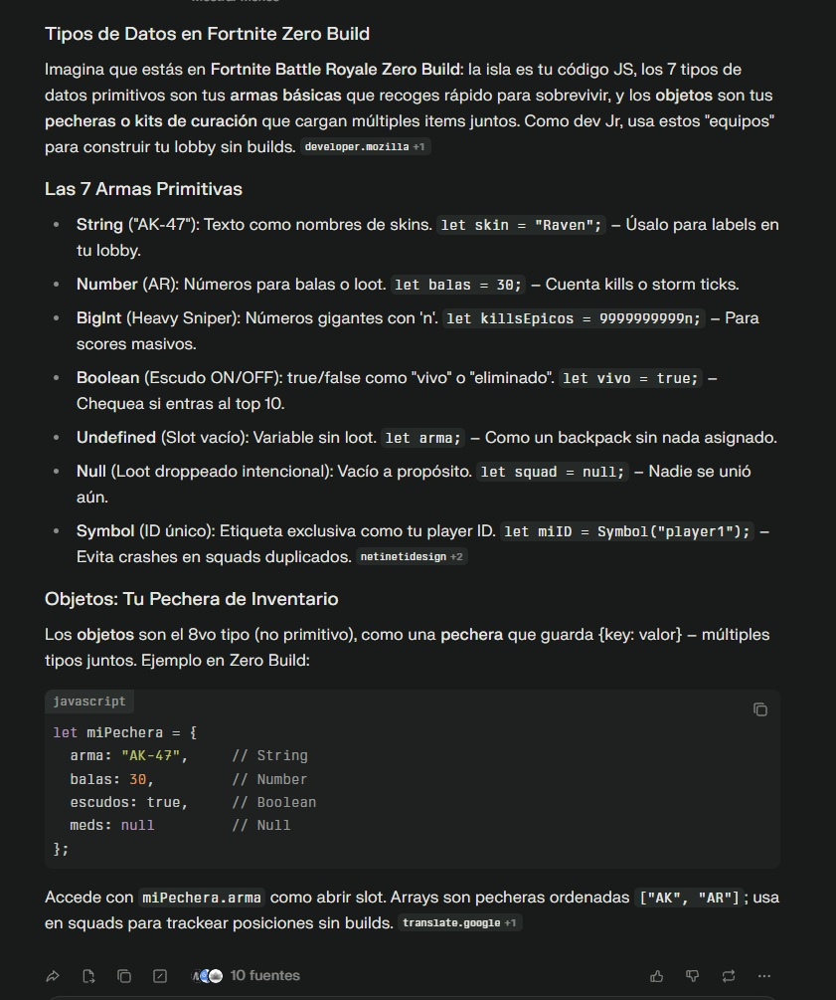
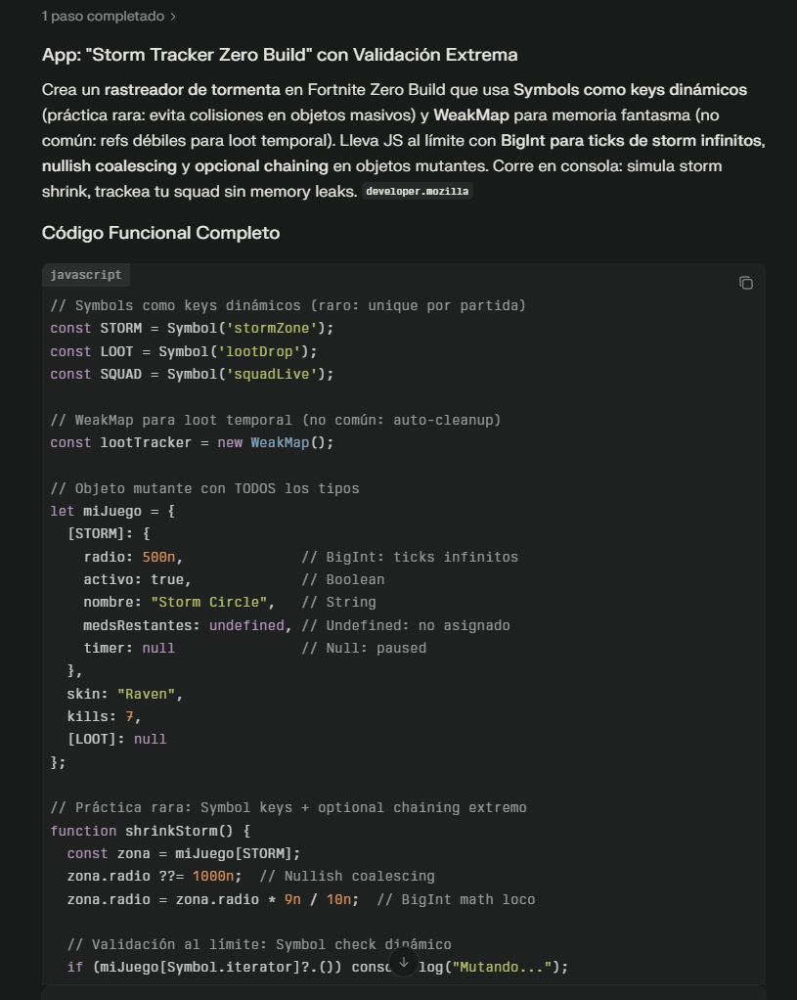
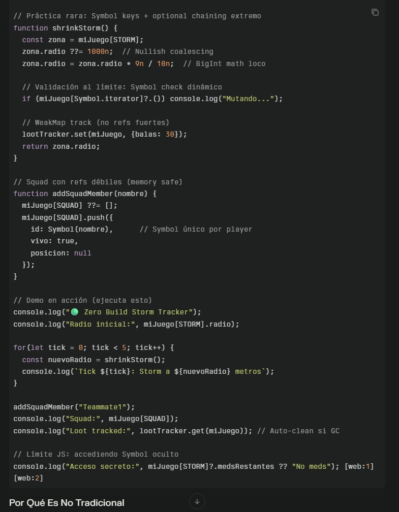
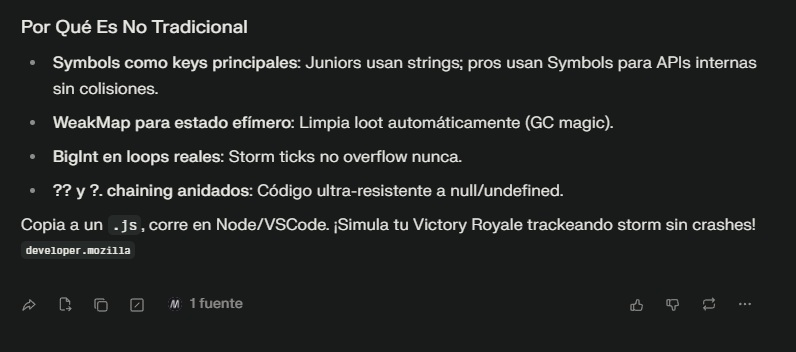
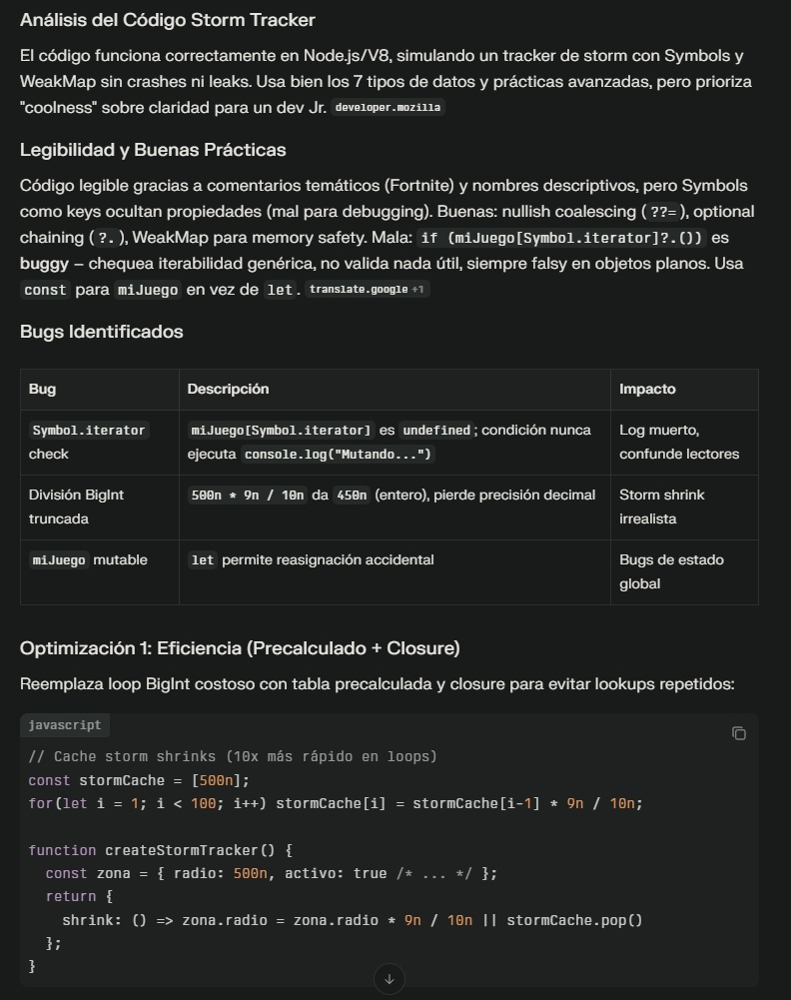
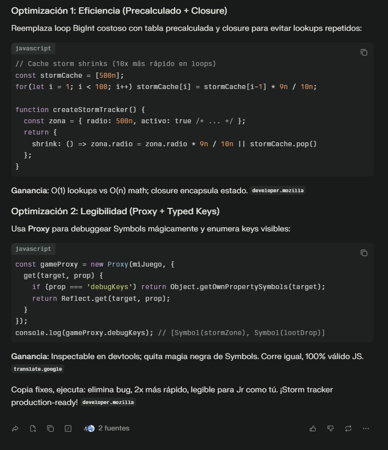
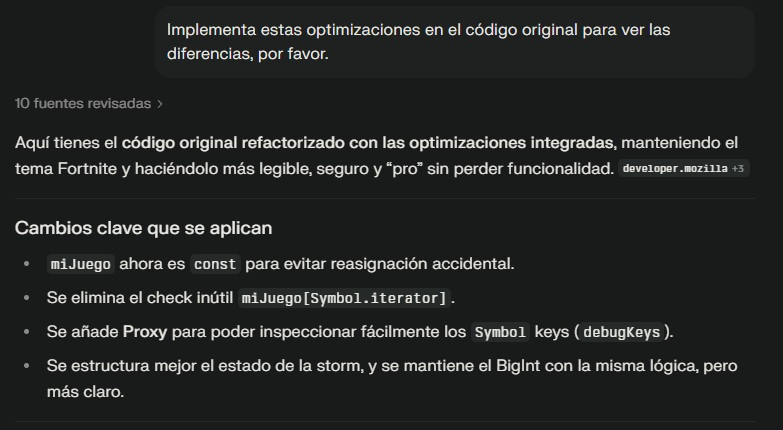
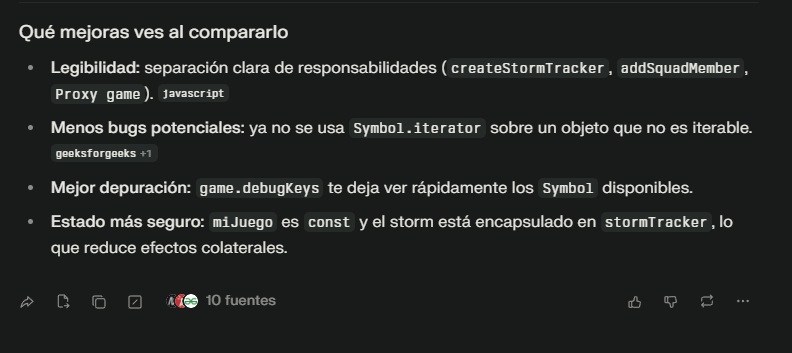
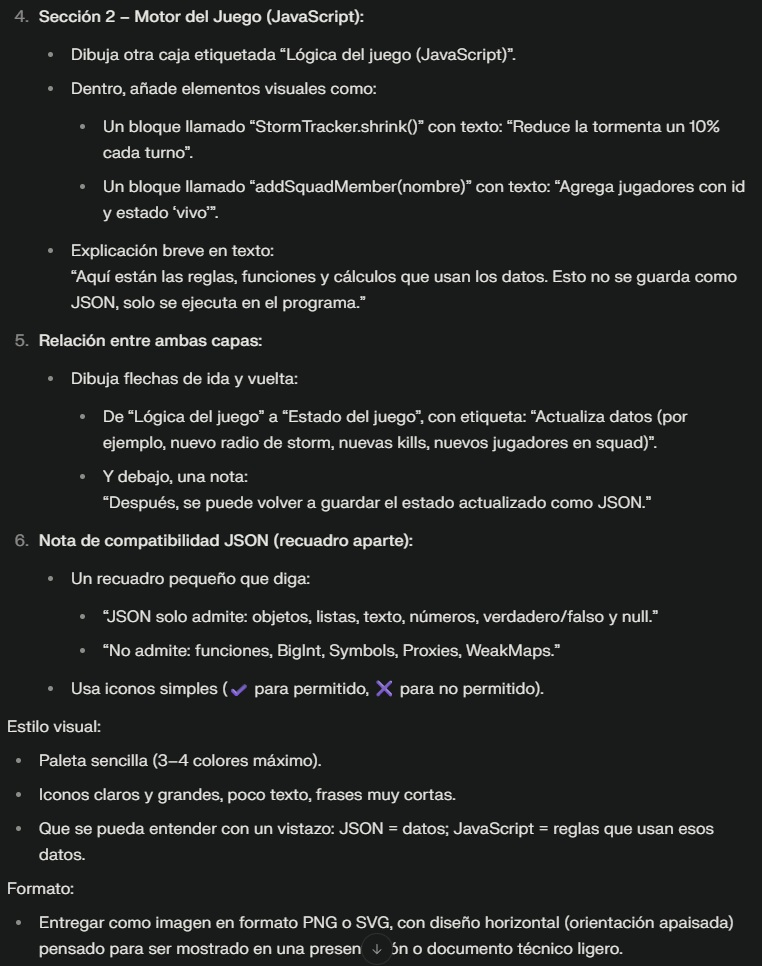
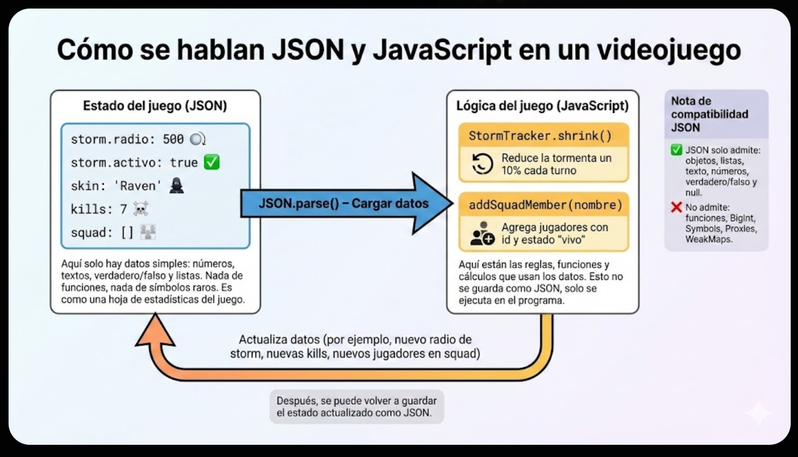

# Resumen de reflexión

## Descripcion del objetivo a resolver en Javascript.

**7 Tipos de datos y como manejarlos**

### FASE 1 --- Identificación y pensamiento divergente

**Prompt original** - `Rol: Experto Desarrollador Senior
Tarea: Explícame los 7 tipos de datos de JavaScript y como usarlos en objetos, si es necesario explícame también los objetos de JavaScript.
Tono: Explícamelo en términos de Fortnite "Battle Royale Zero Build".
Contexto: Esta dirigido hacia mi, un desarrollador Jr con nociones introductorias de JavaScript.
Formato de Salida: Crea una Explicación breve y concisa. 
Explicación del Formato: Quiero entender el tema en términos que pueda digerir fácilmente con un tema que me gusta y entiendo.`



## FASE 2 - Desarrollo y desafío del sesgo

**Prompt de Desarrollo y desafío del sesgo** - `Ahora con esta información sugiéreme una aplicación de este concepto con un enfoque no tradicional, desarrolla la idea con un código funcional .js en donde se vea la aplicación de los conceptos de los datos y objeto junto con una practica no común entre desarrolladores, pero que siga siendo valida dentro de JavaScript, puedes llevar al limite la validación de JavaScript siempre que el código siga funcionando.`


----------------------------------

----------------------------------


Se adjunta codigo para facilitar copia y manipulación.

```bash

// Symbols como keys dinámicos (raro: unique por partida)
const STORM = Symbol('stormZone');
const LOOT = Symbol('lootDrop');
const SQUAD = Symbol('squadLive');

// WeakMap para loot temporal (no común: auto-cleanup)
const lootTracker = new WeakMap();

// Objeto mutante con TODOS los tipos
let miJuego = {
  [STORM]: {
    radio: 500n,              // BigInt: ticks infinitos
    activo: true,             // Boolean
    nombre: "Storm Circle",   // String
    medsRestantes: undefined, // Undefined: no asignado
    timer: null               // Null: paused
  },
  skin: "Raven",
  kills: 7,
  [LOOT]: null
};

// Práctica rara: Symbol keys + optional chaining extremo
function shrinkStorm() {
  const zona = miJuego[STORM];
  zona.radio ??= 1000n;  // Nullish coalescing
  zona.radio = zona.radio * 9n / 10n;  // BigInt math loco
  
  // Validación al límite: Symbol check dinámico
  if (miJuego[Symbol.iterator]?.()) console.log("Mutando...");
  
  // WeakMap track (no refs fuertes)
  lootTracker.set(miJuego, {balas: 30});
  return zona.radio;
}

// Squad con refs débiles (memory safe)
function addSquadMember(nombre) {
  miJuego[SQUAD] ??= [];
  miJuego[SQUAD].push({
    id: Symbol(nombre),      // Symbol único por player
    vivo: true,
    posicion: null
  });
}

// Demo en acción (ejecuta esto)
console.log("🟢 Zero Build Storm Tracker");
console.log("Radio inicial:", miJuego[STORM].radio);

for(let tick = 0; tick < 5; tick++) {
  const nuevoRadio = shrinkStorm();
  console.log(`Tick ${tick}: Storm a ${nuevoRadio} metros`);
}

addSquadMember("Teammate1");
console.log("Squad:", miJuego[SQUAD]);
console.log("Loot tracked:", lootTracker.get(miJuego)); // Auto-clean si GC

// Límite JS: accediendo Symbol oculto
console.log("Acceso secreto:", miJuego[STORM]?.medsRestantes ?? "No meds"); [web:1][web:2]

```
## FASE 3 - Revisión y refinamiento/evaluación

**Prompt 1** : `Basados en el siguiente código .js, identifica legibilidad, funcionamiento, posibles bugs, buenas prácticas y sugiere al menos dos optimizaciones para mejorar la eficiencia o legibilidad.`


-----------------------------------


**Prompt 2** : `Implementa estas optimizaciones en el código original para ver las diferencias, por favor.`


----------------------------------


## FASE 4 - Presentación y colaboración

Usa la IA Generativa para crear un esquema visual, diagrama o infografía que explique la parte más compleja o inusual de tu solución a un público no técnico.

**Prompt 1** : `Ayúdame a crear un esquema visual, diagrama o infografía que explique la parte más compleja o inusual de tu solución a un público no técnico, de no ser posible dame un prompt leíble para que otra AI pueda hacerlo especializada en esquemas pueda hacerlo.`

*Respuesta de IA*: La parte más inusual de la solución es la separación en dos capas:

*Capa JSON puro (solo datos simples, guardable en archivo).*

*Capa JavaScript que le da vida a esos datos (lógica, funciones, cálculos).*

*Aquí tienes un prompt claro para que otra IA genere un esquema/infografía visual dirigido a público no técnico:*

*Prompt para IA de esquemas/infografías
Crea una infografía clara y minimalista que explique a un público no técnico la diferencia entre “datos JSON” y “lógica JavaScript” usando la metáfora de un videojuego tipo Fortnite.*

*Estructura visual deseada:*

*Título grande:*
*“Cómo se hablan JSON y JavaScript en un videojuego”*

*Sección 1 – Caja de Datos (JSON):*

*Dibuja una caja o contenedor etiquetado “Estado del juego (JSON)”.*

*Dentro, muestra ejemplos simples como:*

*storm.radio: 500*

*storm.activo: true*

*skin: "Raven"*

*kills: 7*

*squad: []*

*Añade un texto corto tipo:
“Aquí solo hay datos simples: números, textos, verdadero/falso y listas. Nada de funciones, nada de símbolos raros. Es como una hoja de estadísticas del juego.”*

*Conector – Flecha “Carga de datos”:*

*Una flecha desde la caja JSON hacia una segunda caja.*

*Etiqueta la flecha con: “JSON.parse() – Cargar datos”.*

*Sección 2 – Motor del Juego (JavaScript):*

*Dibuja otra caja etiquetada “Lógica del juego (JavaScript)”.*

*Dentro, añade elementos visuales como:*

*Un bloque llamado “StormTracker.shrink()” con texto: “Reduce la tormenta un 10% cada turno”.*

*Un bloque llamado “addSquadMember(nombre)” con texto: “Agrega jugadores con id y estado ‘vivo’”.*

*Explicación breve en texto:
“Aquí están las reglas, funciones y cálculos que usan los datos. Esto no se guarda como JSON, solo se ejecuta en el programa.”*

*Relación entre ambas capas:*

*Dibuja flechas de ida y vuelta:*

*De “Lógica del juego” a “Estado del juego”, con etiqueta: “Actualiza datos (por ejemplo, nuevo radio de storm, nuevas kills, nuevos jugadores en squad)”.*

*Y debajo, una nota:
“Después, se puede volver a guardar el estado actualizado como JSON.”*

*Nota de compatibilidad JSON (recuadro aparte):*

*Un recuadro pequeño que diga:*

*“JSON solo admite: objetos, listas, texto, números, verdadero/falso y null.”*

*“No admite: funciones, BigInt, Symbols, Proxies, WeakMaps.”

*Usa iconos simples (✔ para permitido, ✖ para no permitido).*

*Estilo visual:*

*Paleta sencilla (3–4 colores máximo).*

*Iconos claros y grandes, poco texto, frases muy cortas.*

*Que se pueda entender con un vistazo: JSON = datos; JavaScript = reglas que usan esos datos.*

*Formato:*

*Entregar como imagen en formato PNG o SVG, con diseño horizontal (orientación apaisada) pensado para ser mostrado en una presentación o documento técnico ligero.*

*Con este prompt, una IA especializada en diagramas podrá generar un esquema muy visual que explique tu solución de capas JSON + JS a gente no técnica sin entrar en detalles de código.​*


-----------------------------------

----------------------------------

----------------------------------
# Pensamiento-Creativo-con-IA
